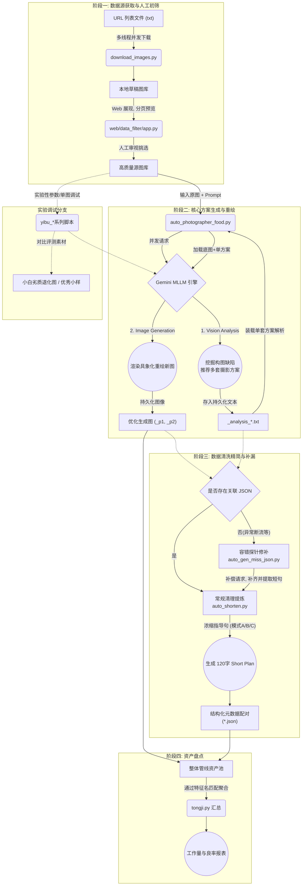

# 食物构图与重绘生产管线 (Food Production Pipeline)

基于对 `D:\workspace\yunwu_gemini` 目录下代码的分析，当前食物图片相关的生产管线主要用于自动化分析现有食物图片，生成优化（或刻意退化）的构图拍摄指导，并利用大语言及视觉模型进行重绘与数据提取。

---

## 1. 核心数据管线 (Data Pipeline)

整个流水线从源数据的获取与初筛，再到核心的大模型多方案生成与重绘，最后到数据的后处理清洗与统计，形成了完整的异步并发闭环。以下是各阶段的详细流转过程：

### 阶段一：数据源获取与人工初筛 (Data Preparation)
1. **URL加载与去重下载**：`data_sby/download_images.py` 负责读取像 `xiawucha.txt` 等预设好的图像 URL 列表文件。借助 `requests` 库利用多线程机制将图片下载至本地（例如 `D:\food_rednote\images`），并在下载过程中处理重名图片，保存异常失败清单。
2. **Web可视化人工初筛**：为了保证送入大模型的图片质量，系统提供了基于 Flask 构建的轻量级人工检验工具 `data_sby/web/data_filter/app.py`。该工具以分页预览的形式在网页中展示刚才下载的所有源图片，人工挑选符合“典型食物拍照构图”规律的优质图片，后台会将选中的好图拷贝留存到目标“优质图库”文件夹中（例如 `images_good`），完成数据的准入。

### 阶段二：大语言&视觉模型核心生产 (Core Generation)
这一阶段是整个管线的心脏，由 `auto_photographer_food.py` 脚本负责进行大批量图文生成任务的并发调度。
1. **构图缺陷分析与方案推荐**：调用 `gemini-3.1-pro-preview` 大语言及视觉联合模型，传入优质源图和内置强大的 Prompt (如 `PROMPT_PLANNER_FOOD_v4`，其让 AI 扮演专业美食摄影师角色)。模型通过分析源图的不佳构图，输出2至4套不同视角的优化拍摄与重绘方案（包含机位、焦段、打光、构图、摆盘等）。结果统一解析为结构化的 `XML` 或 `JSON` 并以 `_analysis_seed.txt` 的形式持久化保存。
2. **新视角与构图效果具现**：一旦分析出具体的优化方案，系统利用正则匹配解析方案字段，进一步并发调用针对多模态重绘优化的模型 `gemini-3-pro-image-preview`。该模型以原图为底，加上指定的细化方案，重新绘制出一张（或多张，对应方案数）具有美感提升、镜头位置变换（甚至包含俯仰角、偏航角的摄影几何变化）的输出图，文件以 `_p1_`、`_p2_` 标记。
3. **补充调试路径（实验与专项测试）**：并行存在的 `yibu_ybx_food.py` 及 `yibu_sby.py` 是为主流程之外提供的微调入口。支持传入单一或小批图集，用于专门检验摄影小白退化视角（比如强行约束机位平移+0°俯拍的烂构图指令），使得生产管线既可产出正向“好图”，也可产出反向“坏图”用于对比评测。

### 阶段三：元数据清洗压缩与对齐补漏 (Refinement & Recovery)
大模型在阶段二生成的方案常带有冗长的思维链及 XML 标签，需要后处理才能作为标准知识库或应用展示的数据。
1. **短摘要精简提炼 (`auto_shorten.py`)**：为了在 UI 展示端提供短小精悍的摄影提示（120字以内的一句话总结），脚本引入了专门的 Shorten Agent。将原本详尽冗长的方案，输入并要求浓缩出类似“换长焦，蹲低拍”这样的金句指引，提供 A（纯文本单转）、B（带原图参考）、C（原图+修改后图+文）三种交叉验证浓缩模式。处理后以 `.json` 无缝绑定在相应的生成图片旁。
2. **状态探针与智能补漏 (`auto_gen_miss_json.py`)**：在海量批量重绘的过程中，偶发由于 API 返回流中断导致的“有图无 JSON 数据”的半成品状态。该脚本使用 `os.walk` 高速扫描生产输出目录，当侦测到只有 `_pX_` 图片却没有配套 `.json` 数据集时，将其自动拉入补漏任务队列重新通过模式 C 生成 `short_plan` ，确保双胞胎（Image+Json）数据齐整完备。

### 阶段四：资产盘点 (Analytics)
- **数据统计 (`tongji.py`)**：利用文件名模式匹配功能，扫描统计指定的生产输出工作区（如 `D:\food_dzdp\output`），检索如 `_p` 或者 `_gen_` 等特征后缀，以输出当天流水线实际的吞吐吞片量与良品率。

### 核心管线矢量流程图



---

## 2. API 调用介绍

整个过程高度依赖基于 OpenAI 规范封装的 API 接口 (`yunwu.ai/v1`) 驱动底层的 Gemini 模型。

- **依赖模型**:
  - `gemini-3.1-pro-preview` / `gemini-3-pro-preview` (文本生成、逻辑推理与图像分析)
  - `gemini-3-pro-image-preview` (基于原图特性的新型重绘生成)
- **典型调用命令** (以 `auto_photographer_food.py` 为例):
  ```bash
  python auto_photographer_food.py --input D:/food_input --output D:/food_output --workers 5 --prompt_version v4 --mode C
  ```
- **参数说明**:
  - `--workers`: 可以指定的并发线程数。
  - `--prompt_version`: 指定调用的提示词基座版本 (v1~v4)。由于任务不同，版本决定了是用来进行优化还是其他调整。
  - `--mode`: 精简模式选项 (A: 纯文本精推 / B: 图文参考精修 / C: 修改前后图文对比精简)。

---

## 3. 关键 Prompt 分类与数据结构

### 3.1 Prompt 模块划分 (`prompt_ybx.py` / `prompt_sby.py`)

- **专业指导 (Photographer Optimization)**:
  分析原图潜力，从"我看到的"进化为"我拍出的"。指导模型输出严谨的“构图逻辑”（比如三分法），并细化“焦段”、“打光”、“机位偏移角（Yaw/Pitch/Roll）”。
- **小白视角退化 (Amateur Degradation)**:
  针对原本完美的图片，要求大模型刻意生成构图缺陷（如画面失衡、呆板生硬、主体偏移），并明确限定镜头 XYZ 的死板位移或固定俯仰角（Pitch=90度、0度），制作对照实验的 Before 样本。

### 3.2 数据序列化结构 (XML & JSON)

大模型在处理**构图方案**时，主要被约束返回清晰可定界的 `<scheme>` XML 结构：
```xml
<scheme>
    ### 方案1：[景别角度|主题]
    - **摆盘建议**：[图片美食及其他物体的调整建议]
    - **构图**：[具体构图方法与主体占比]
    - **机位**：[俯仰角/相机调整]
    - **焦段**：[例如应用长焦3X]
    - **打光与色调**：[环境氛围]
</scheme>
```

在系统最终存盘时（用于后续业务展示与管理），将被转化为统一的 JSON 结构存放于输出图的同名关联文件中：
```json
{
    "theme": "特写俯拍|暗调氛围",
    "original_plan": "（大模型输出的数百字的详尽 XML/Markdown 指导案列段落...）",
    "short_plan": "换长焦，蹲低拍，离近点，把后面的蓝色饮料稍微往汉堡正后方移动一点成为前景...",
    "mode": "C",
    "prompt": "（当前生图或分析所采用的系统基座 Role & Task Prompt 文本...）"
}
```
